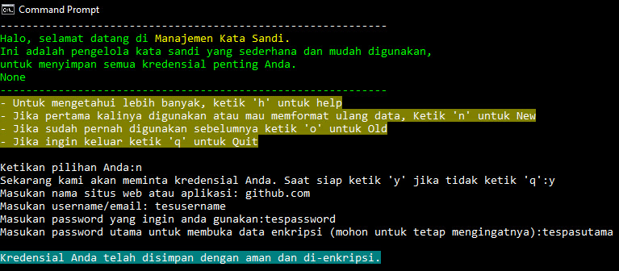
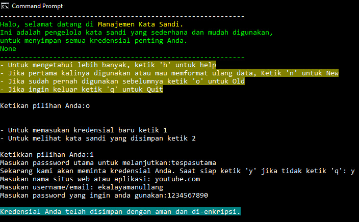
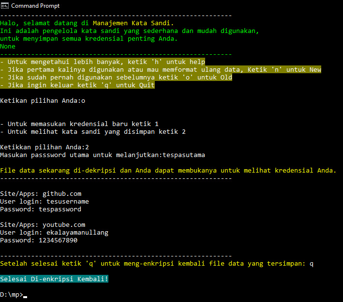

# ManajemenPassword
Aplikasi Manajemen Password Atau Pengelola Kata Sandi yang sederhana mudah digunakan namun cukup efektif dan aman. 
Dibuat dengan Python.

## Setup / Install

### Make sure Python/PIP is installed
- For Linux
```bash
apt update
apt install python3
apt install python3-pip
```

### Install Pipenv and Dependencies
- For Linux
```bash
pip install pipenv
pipenv install
```
### Install cryptography package

```bash
pip install cryptography
```

D:\folder>py mp.py






